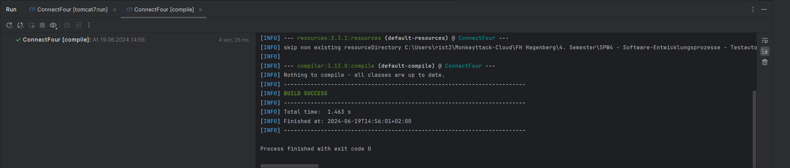
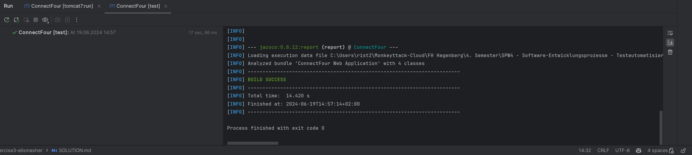
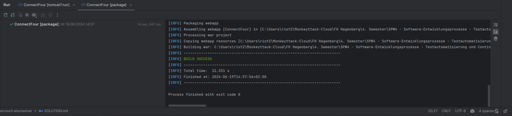
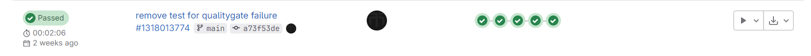

SPW4 - Exercise 3
=================

Name: Rist Elias

Effort in hours: 2h

## 1. Connect Four Web Application and CI/CD Pipeline

Die Aufgabe 1)a) und 1)b wurden bereits in der Übung gemeinsam mit dem Prof. realisiert.

### Task 1.a

```mvn compile```  


```mvn test```  


```mvn package```  


```mvn tomcat7:run```  


### Task 1.b



### Task 1.c

<!--- describe your solution here --->

## Sonarqube

Zum starten:
1. Linux Konsole öffnen (wsl)
```bash
sudo -i
cd /root
.\gitlab-runner run
```
2. Docker starten

3. Neue Konsole (normal) öffnen
```bash
docker run -d --name sonarqube --restart always --network runner-net -p 9000:9000 -e SONAR_ES_BOOTSTRAP_CHECKS_DISABLE=true sonarqube:10.4.1-community
```

4. Browser öffnen
````
http://localhost:9000/
````